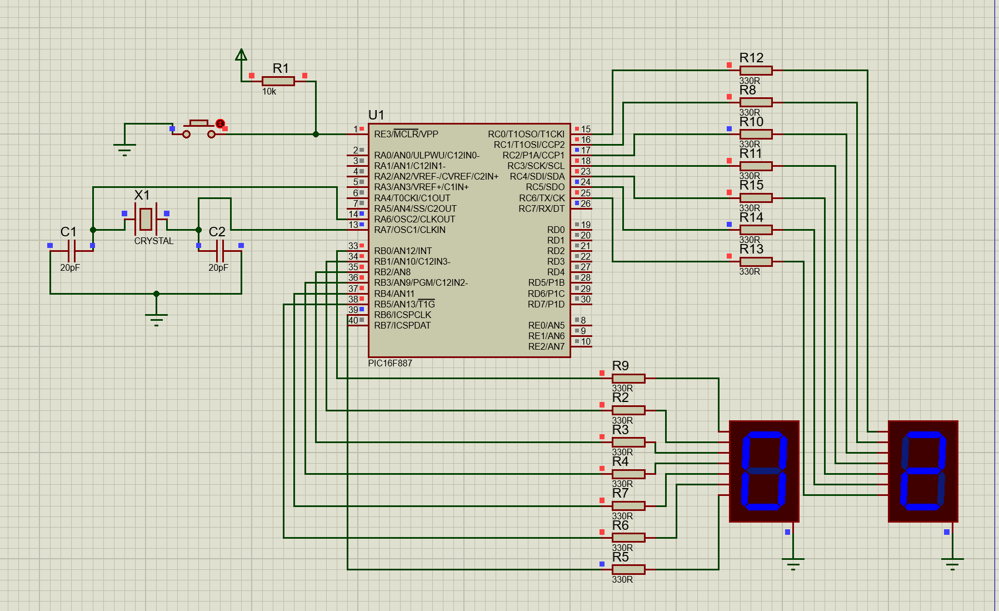

# Dual-7-Segment-Display

## Description
This project extends the setup to include two 7-segment displays, allowing numbers from 00 to 99 to be displayed using a PIC16F887 microcontroller.

## Circuit
  
*The circuit schematic for the dual 7-segment displays.*

## Files
- `Dual-7-Segment-Display.pdsprj`: Circuit schematic for the dual 7-segment displays.
- `Dual-7-Segment-Display.c`: MikroC program for controlling the dual displays.

## Instructions
1. Open `Dual-7-Segment-Display.pdsprj` in Proteus.
2. Load and compile `Dual-7-Segment-Display.c` in MikroC to create the hex file.
3. Upload the hex file into the microcontroller in Proteus.
4. Run the simulation to observe numbers from 00 to 99 being displayed.

## Tools
- MikroC Pro for PIC
- Proteus ISIS
